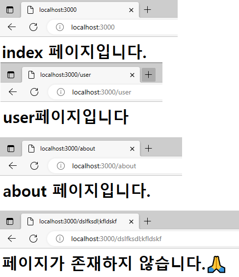
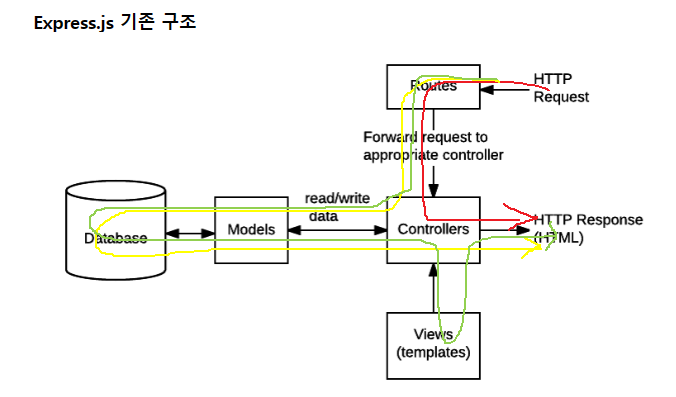
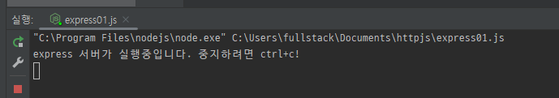
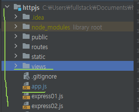
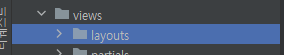
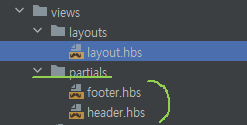

# Node Server
* 노드에 기본적으로 존재하는 내장함수를 사용하여 로컬 서버를 열 수 있다.
## 서버통신
* 서버자원가져올때 :get을 사용한다. 만약, 데이터를 서버로보내야 하는경우에 쿼리스트링을 사용한다.
* 서버에 자원을 새로등록할때 :post를 사용한다.
* 주소를보고 요청을알아낼수있는것이 REST의 장점이다.
* http를 사용하면 클라이언트가누구든상관없이 같은방식으로 서버와소통할 수 있다.
## [사용방법](/server01.js)<br>
1. 내장 라이브러리인 http를 불러온다 
```javascript
const http =  require('http');
```
2. 노드에 환경변수인 PORT를 확인하고 없으면 3000번 포트를 열어준다
```javascript
const port = process.env.PORT || 3000;
```

3. 서버를 생성한다.
* 여기에서, req는 요청이고 res는 응답이다. 서버에서는 요청과 응답이 반드시 필요하다. 
```javascript
const server=  http.createServer((req, res)=>{
    
});
```

4. 서버실행 리스너를 실행한다.
```javascript
server.listen(port,()=>{
    console.log('서버가 실행중입니다. 중지하려면 ctrl+c!');
});
```

5. 요청이왔을때 응답을 위한 이벤트리스너를 등록한다.[생성한 서버 안에 추가]
```javascript
const server=  http.createServer((req, res)=>{
    //서버응답 처리부분
    //데이터 형식 작성
    const html= 'text/html; charset=utf8';

    // req.url은 응답받은 url로, url경로가 다음과 같은 케이스 이면,
    // 다른 페이지로 응답한다.
    // Routing이라고 함
    switch (req.url){
        case '/':
            //응답코드 200, 응답 데이터 형식지정
            res.writeHead(200,{'Content-Type':html});
            res.end('<h1>index 페이지입니다.</h1>');
            break;
        case '/user':
            res.writeHead(200,{'Content-Type':html});
            res.end('<h1>user페이지입니다</h1>');
            break;
        case '/about':
            res.writeHead(200,{'Content-Type':html});
            res.end('<h1>about 페이지입니다.</h1>');
            break;
        default :
            res.writeHead(404,{'Content-Type':html});
            res.end('<h1>페이지가 존재하지 않습니다.🙏</h1>');
    }
});

```
> 결과<br>
>  <br>


# Express
* 가장 인기있는 Node 웹 프레임워크로
*  HTTP 통신 요청(Request; GET, POST, DELETE 등)에 대한 핸들러를 만들수 있음
*  템플릿에 데이터를 넣어 응답을 만들기 위해 view의 렌더링 엔진과 결합할 수 있음
*  핸들링 파이프라인 중 필요한 곳에 추가적인 미들웨어 처리 요청을 추가 가능
*  Express 자체는 꽤나 최소한의 기능만 탑재되어 있지만, 추가적으로 쿠키, 세션, 사용자 로그인, URL 파라미터, POST 데이터, 보안 헤더와 그외 많은 것들에 대한 라이브러리들을 사용할 수 있음
>  <br>
> 
*  route : 요청(및 요청 URL에 인코딩된 모든 정보)을 적절한 컨트롤러로 전달함
* controller: 모델에서 요청된 데이터를 가져오고, 뷰를 이용해서 데이터를 표시하는 HTML 페이지를 생성한 다음, 브라우저에서 이것을 볼 수 있도록 반환
* view: 데이터를 렌더링하는 데 사용하는 HTML 템플릿

## Express Server
* 노드에서 로컬포트를 열어 서버를 열 수있다.
### 사용방법 
1. 가져오기
* npm 에서 express를 설치 후 가져온다.
```text
$ npm install express --save
```
```javascript
const express = require('express');
```

2. 포트설정하기
* 가져온 express를 기반으로 포트를 설정하는데, 1000번 이하는 이미 PC에서 사용하고있는 포트일 확률이 매우 높으므로, 1000번 이상의 포트만을 사용하도록 한다. 가장 많이 사용하는것은 8080이나, 예시처럼 3000번의 포트를 사용해도 된다.
```javascript
const port = process.env.PORT || 3001;
```

3. 서버 열기 
* 설정한 포트를 express에 내장되어있는 listen함수를 통해 서버를 실행시켜준다.
```javascript
app.listen(port,()=>{
    console.log('express 서버가 실행중입니다. 중지하려면 ctrl+c!');
});
```
>결과<br>
> ;

## Router
* 노드서버를 기반으로 페이지간 이동을 위해 사용할 수 있다.
* Router가 메인이 되는경우, [공식홈페이지 가이드](https://expressjs.com/)에 따라서 app.js파일을 지정한다.
### 사용방법
1. express와 미들웨어 모듈을 선언한다
```javascript
const express = require('express');
const path = require('path');
const logger = require('morgan');
```

2. 라우팅 모듈을 선언한다. [라우팅모듈 선언방법](#라우팅모듈)
```javascript
const indexRouter =  require('./route/index');
const userRouter =  require('./route/user');
const aboutRouter =  require('./route/about');
```

3. express 객체 생성 및 포트 변수를 선언한다.
```javascript
const app = express();
// node에서 지원하는 환경변수인 port를 찾고 없으면 3000번으로 시작
const port =  process.env.PORT || 3000;
```

4. 라우팅이 없이 바로 호출이 가능할 수 있는 static폴더를 설정한다
* 해당 폴더는 이미지, css, js등 asset을 가지고있는 폴더를 지정하는데, 가이드에 맞추어 static안에 모든 asset파일을 넣는다.
```javascript
app.user(express.static(path.join(__dirname,'staic')));
```

5. 라우팅 모듈을 등록한다.
* 클라이언트 요청 처리의 핵심파트이다.
```javascript
// app.use(들어오는경로,출력할 모듈);
app.use('/',indexRouter);
app.use('/member',memberRouter);
app.use('/board',boardRouter);
```

6. 404,500에 대한 응답코드 라우팅 처리
```javascript
app.use((req,res)=>{
    res.status(404);
    res.send('404-페이지가 없습니다.');
});

//오류
app.use((error,req,res)=>{
    res.status(500);
    res.send('500-에러입니다');
});

```

## [Handlebars(view)](./app.js)
* 라우팅처리에 의해서 직접적으로 html파일을 가져와 응답해줄 수 있는데, 이때 UI들을 모듈화해서 관리하면 유지보수가 용이하다.
* 이때, 사용하는 UI 템플릿은  여러가지가 있지만, 그 중 핸들바(hbs)를 사용해 보고자한다.
### 사용방법 
1. main(app.js)안에 핸들바를 설치한다.
```javascript
const {engine}= require('express-handlebars');
```
2. view엔진설정에 핸들바를 설정해준다.
* 여기서, helpers란 UI를 모듈화하여 따로 관리할 수 있게 적용해주는 엔진이다.
```javascript
app.engine('hbs',engine({
    // 확장자명
    extname: '.hbs',
    // 기본으로 제공되는것, 레이아웃 : 없다면 main.hbs가 자동으로 설정됨
    //기본 레이아웃은 반드시 views/layouts/안에 존재시켜야 함
    defaultLayout : 'layout',
    //UI를 모듈화하여 따로 관리할 수 있게 적용
    helpers: {
        section: function(name, options) {
            if(!this._sections) this._sections = {}
            this._sections[name] = options.fn(this)
            return null
        },
    },
}))
```
3. 핸들바 파일들이 들어있는 views 폴더에 대해 경로로 설정해 주고 엔진을 추가한다.
```javascript
app.set('views',path.join(__dirname,'views'));
//핸들바 뷰 엔진 추가
app.set('view engine','hbs');
```

4. 핸들바사용을 위한 폴더를 새로 생성하는데, app.js위치 기준에서 views라는 폴더를 생성한다.
> 예시<br>
>  <br>


5. views폴더 안에 기본 고정탬플릿 역할을 하는 layout을 만들기 위해 layouts폴더를 생성한다.
> 예시<br>
>  <br>

6. layouts폴더 안에 기본 고정 템블릿인 layout.hbs를 만든다. (만약 layout이 없다면 main으로 자동 생성됨)
> 예시<br>
>  <br>

7. layouts파일엔 다음과 같이 고정 템플릿 내용을 작성한다.
* 이때, 사용하게 될 header나 footer같은 고정값의 템플릿모듈은 partials 폴더안에서 관리하며, partials폴더안의 파일명을 {{>파일명}} 형식으로 작성하면 된다.
* css와 script와 같이 UI가 아닌 파일들의 경우엔 2.번에서 등록한 helpers의 section엔진을 사용하여 {{{_section.섹션명}}}이 들어가면 된다.
* {{{body}}}는 라우터로 불러와 질 페이지의 내용들이 업데이트 된다.
```html
<!DOCTYPE html>
<html lang="ko">
<head>
    <meta charset="UTF-8">
    <title>{{ title }}</title>
    {{{_sections.css}}}
</head>
<body>
{{>header}}

{{{ body }}}

{{>footer}}

{{{_sections.script}}}
</body>
</html>
```

8. views폴더 안에 partials라는 폴더를 만들고 그 안에 header와 footer등 고정되는 UI템플릿 파일을 저장한다. 
* 이때 모든 html역할을 하는 파일들은 .hbs확장자를 준수한다.
> 예시<br>
>  <br>

9. 라우터를 통해서 지정한 파일들의 내용을 작성한다.
* 여기에서 style혹은 script는 아까 7번 layout에서 고정한 내용과 같이 section을 사용하면 된다.
* 사용방법은 {{#section '섹션명'}} 형식으로 입력하면 된다.
* index.hbs
```hbs
{{#section 'css'}}
    <style>
        h1{
            color:green;
        }
    </style>
{{/section}}


<h1>인덱스 페이지입니다 👧</h1>


{{#section 'script'}}
    <script>
        alert('??');
    </script>
{{/section}}

```
* about.hbs
```hbs
{{#section 'css'}}
    <style>
        h1{
            color:blue;
        }
    </style>
{{/section}}
<h1>어바웃 페이지입니다 👀</h1>

```
* user.hbs
```hbs
{{#section 'css'}}
    <style>
        h1{
            color:red;
        }
    </style>
{{/section}}
<h1>유저 페이지입니다 👌</h1>


```

10. 라우터 모듈을 수정한다.
* 전과 같이 path를 활용할 필요가 없고 render를 활용하여 파일명과 부가적으로 들어갈 parameter에 대한 값을 입력해주면 된다.
* routes/index.js
```javascript
const express =  require('express');
const path = require('path');
const router = express.Router();

router.get('/',(req, res)=>{

    res.render('index',{title:'index페이지'});
});

module.exports = router;
```
* routes/about.js
```javascript
const express =  require('express');
const path = require("path");
const router = express.Router();

router.get('/',(req, res)=>{

    res.render('about',{title:'어바웃페이지'});
});
module.exports = router;
```
* routes/user.js
```javascript
const express =  require('express');
const path = require("path");
const router = express.Router();

router.get('/',(req, res)=>{

    res.render('user',{title:'유저페이지'});
});
module.exports = router;
```

## Controllor

## 모놀리스 개발방식
* 한두페이지 안에 모든 기능을 넣어 개발하는 방식

## 마이크로서비스 개발방식
* 기능별로 서버를 따로만들어서 개발하는방식
* e.g. react + express SPA방식

온프레미스 , 클라우드